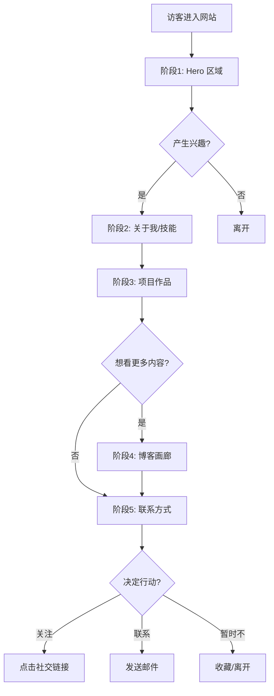

# 产品需求文档：ALan 个人网站 - V1.0

**版本**：V1.0  
**日期**：2026-02-04  
**作者**：ALan  
**状态**：已确认，待开发

---

## 1. 综述 (Overview)

### 1.1 项目背景与核心问题

作为一名 AI 产品经理和 Vibe Coder，需要一个专业的个人网站来：

- **展示个人品牌**：传达"AI 产品经理 + Vibe Coder"的独特定位
- **呈现作品集**：展示 JobBuff、jobhunter 等 AI 项目作品
- **建立连接**：提供与潜在雇主、合作方、同行的联系渠道
- **分享内容**：以画廊形式展示学习笔记和产品思考

**视觉风格**：梦幻渐变 + 毛玻璃 (Dreamy Gradient + Glassmorphism)  
**布局参考**：[xmmxovo.online](https://xmmxovo.online/)  
**视觉参考**：[reflect.app](https://reflect.app/)、[stripe.com](https://stripe.com/)

### 1.2 核心业务流程 / 用户旅程地图

```
阶段 1 → 阶段 2 → 阶段 3 → 阶段 4 → 阶段 5
发现     了解     信任     探索     行动
```

| 阶段 | 名称 | 用户目标 | 对应模块 |
|-----|------|---------|---------|
| **1** | 发现 (First Impression) | 快速判断"这是谁，我为什么要看" | Hero 区域 |
| **2** | 了解 (Explore Background) | 深入了解背景、经历、技能 | 关于我 + 技能 |
| **3** | 信任 (Validate Skills) | 看到实际作品，验证能力 | 项目作品 |
| **4** | 探索 (Browse Content) | 浏览笔记/文章，感受思考深度 | 博客画廊 |
| **5** | 行动 (Convert) | 决定联系/关注 | 联系方式 |

### 1.3 Mermaid 图

#### 1.3.1 用户操作流



---

## 2. 用户故事详述 (User Stories)

### 阶段一：发现 (First Impression)

---

#### **US-01: 作为首次访问的访客，我希望能在 3 秒内了解网站主人是谁、做什么，以便于快速判断这个网站是否值得继续浏览。**

- **价值陈述 (Value Statement)**:
  - **作为** 首次访问的访客
  - **我希望** 在页面首屏看到清晰的个人介绍和视觉形象
  - **以便于** 快速判断是否继续浏览

- **业务规则与逻辑 (Business Logic)**:
    1. **前置条件**: 访客通过任意渠道进入网站首页
    2. **操作流程 (Happy Path)**:
        - 访客看到导航栏、个人介绍文案、头像插画
        - 快速获取关键信息：姓名、职业、核心标签
        - 通过 CTA 按钮引导下一步行动
    3. **异常处理**: 无网络时显示友好的加载提示

- **验收标准 (Acceptance Criteria)**:
  - **场景1: 首次加载**
    - **GIVEN** 访客首次进入网站
    - **WHEN** 页面加载完成
    - **THEN** 在 3 秒内显示完整的 Hero 区域内容

- **页面布局线框图 (ASCII Wireframe)**:

    ```
    ┌──────────────────────────────────────────────────────────────────────┐
    │                          [ 导航栏 - 胶囊样式 ]                         │
    │                   首页  |  关于  |  项目  |  博客  |  联系              │
    ├──────────────────────────────────────────────────────────────────────┤
    │                                                                      │
    │   ┌─────────────────────────────┐   ┌─────────────────────────────┐  │
    │   │                             │   │                             │  │
    │   │   Hello! 我是 →             │   │     ┌─────────────────┐     │  │
    │   │                             │   │     │                 │     │  │
    │   │   ALan.                     │   │     │   [ 头像插画 ]   │     │  │
    │   │                             │   │     │                 │     │  │
    │   │   ┌─────────┐ ┌─────────┐   │   │     │                 │     │  │
    │   │   │ AI产品经理│ │Vibe Coder│   │   │     └─────────────────┘     │  │
    │   │   └─────────┘ └─────────┘   │   │                             │  │
    │   │                             │   └─────────────────────────────┘  │
    │   │   用 AI 重新定义工作流程     │                                    │
    │   │                             │                                    │
    │   │   ┌──────────┐ ┌──────────┐ │                                    │
    │   │   │ 查看作品 →│ │ 联系我 ✦ │ │                                    │
    │   │   └──────────┘ └──────────┘ │                                    │
    │   │                             │                                    │
    │   └─────────────────────────────┘                                    │
    │                                                                      │
    │                  [ 背景：蓝粉渐变 + 星星/云朵装饰 ]                     │
    │                                                                      │
    └──────────────────────────────────────────────────────────────────────┘
    ```

---

### 阶段二：了解 (Explore Background)

---

#### **US-02: 作为对网站主人产生初步兴趣的访客，我希望能快速了解他的背景、经历和核心技能，以便于判断他是否具备我需要的专业能力。**

- **价值陈述 (Value Statement)**:
  - **作为** 产生初步兴趣的访客
  - **我希望** 看到清晰的背景介绍和技能展示
  - **以便于** 判断专业能力是否匹配需求

- **业务规则与逻辑 (Business Logic)**:
    1. **前置条件**: 访客已浏览 Hero 区域并产生兴趣
    2. **操作流程 (Happy Path)**:
        - 向下滚动或点击导航进入"关于我"区域
        - 查看教育背景、工作经历、核心理念
        - 浏览技能分类和具体技能标签
    3. **异常处理**: 无

- **验收标准 (Acceptance Criteria)**:
  - **场景1: 查看关于我**
    - **GIVEN** 访客在首页
    - **WHEN** 滚动到"关于我"区域
    - **THEN** 显示三张卡片（教育/工作/理念）和技能矩阵

- **页面布局线框图 (ASCII Wireframe)**:

    ```
    ┌──────────────────────────────────────────────────────────────────────┐
    │                         ✦ 关于我 ✦                                  │
    ├──────────────────────────────────────────────────────────────────────┤
    │                                                                      │
    │   ┌─────────────────┐  ┌─────────────────┐  ┌─────────────────┐      │
    │   │  [ 毛玻璃卡片 ]  │  │  [ 毛玻璃卡片 ]  │  │  [ 毛玻璃卡片 ]  │      │
    │   │                 │  │                 │  │                 │      │
    │   │   🎓 教育背景   │  │   💼 工作经历   │  │   💡 核心理念   │      │
    │   │                 │  │                 │  │                 │      │
    │   │ 中国传媒大学    │  │  2年+ 产品经验  │  │  Vibe Coding   │      │
    │   │    硕士         │  │  数据分析经验   │  │ 用自然语言编程  │      │
    │   │                 │  │                 │  │                 │      │
    │   └─────────────────┘  └─────────────────┘  └─────────────────┘      │
    │                                                                      │
    ├──────────────────────────────────────────────────────────────────────┤
    │                         ✦ 技能 ✦                                    │
    ├──────────────────────────────────────────────────────────────────────┤
    │                                                                      │
    │   ┌─────────────────────────┐   ┌─────────────────────────┐          │
    │   │ 🤖 AI 编程              │   │ 📊 数据分析             │          │
    │   │ [Claude Code] [Antigravity] │ │ [Python] [SQL] [BI]   │          │
    │   └─────────────────────────┘   └─────────────────────────┘          │
    │                                                                      │
    │   ┌─────────────────────────┐   ┌─────────────────────────┐          │
    │   │ 💡 产品设计             │   │ ⚡ 自动化               │          │
    │   │ [PRD撰写] [用户调研]    │   │ [N8N] [Dify] [Coze]    │          │
    │   └─────────────────────────┘   └─────────────────────────┘          │
    │                                                                      │
    └──────────────────────────────────────────────────────────────────────┘
    ```

---

### 阶段三：信任 (Validate Skills)

---

#### **US-03: 作为想验证网站主人能力的访客，我希望能看到他做过的实际项目和作品，以便于判断他的技术水平和产品思维。**

- **价值陈述 (Value Statement)**:
  - **作为** 想验证能力的访客
  - **我希望** 看到实际项目作品和详细介绍
  - **以便于** 判断技术水平和产品思维

- **业务规则与逻辑 (Business Logic)**:
    1. **前置条件**: 访客已浏览"关于我"区域
    2. **操作流程 (Happy Path)**:
        - 浏览项目卡片（截图 + 标题 + 功能亮点）
        - 点击卡片打开详情弹窗
        - 查看痛点、技术亮点、项目成果
        - 点击"访问项目"跳转到部署网站或 GitHub
    3. **异常处理**: 项目链接失效时显示提示

- **验收标准 (Acceptance Criteria)**:
  - **场景1: 查看项目详情**
    - **GIVEN** 访客在项目区域
    - **WHEN** 点击项目卡片
    - **THEN** 弹出项目详情模态框，显示完整信息

- **项目列表**:

    | 项目 | 功能亮点标签 | 链接类型 |
    |-----|-------------|---------|
    | JobBuff | AI分析JD、简历匹配、求职策略 | 已部署网站 |
    | jobhunter | 自动抓取、数据可视化 | GitHub |
    | 个人网站 | AI编程打造、Vibe Coding | 当前网站 |

- **页面布局线框图 - 项目卡片**:

    ```
    ┌──────────────────────────────────────────────────────────────────────┐
    │                      ✦ 我的作品 ✦                                   │
    ├──────────────────────────────────────────────────────────────────────┤
    │                                                                      │
    │  ┌────────────────────┐  ┌────────────────────┐  ┌────────────────┐  │
    │  │ [  项目截图预览  ] │  │ [  项目截图预览  ] │  │ [ 项目截图 ]  │  │
    │  │                    │  │                    │  │                │  │
    │  │  JobBuff           │  │  jobhunter         │  │  个人网站      │  │
    │  │  岗位智能分析助手  │  │  Boss直聘职位抓取  │  │  Vibe Coding  │  │
    │  │                    │  │                    │  │                │  │
    │  │  ● AI分析JD        │  │  ● 自动抓取        │  │ ● AI编程打造  │  │
    │  │  ● 简历匹配        │  │  ● 数据可视化      │  │               │  │
    │  │                    │  │                    │  │                │  │
    │  │  [ 查看详情 → ]    │  │  [ 查看详情 → ]    │  │ [查看详情 →]  │  │
    │  └────────────────────┘  └────────────────────┘  └────────────────┘  │
    │                                                                      │
    └──────────────────────────────────────────────────────────────────────┘
    ```

- **页面布局线框图 - 项目详情弹窗**:

    ```
    ┌────────────────────────────────────────────────────────────────────────────┐
    │                                                                    [ × ]   │
    ├─────────────────────────────────┬──────────────────────────────────────────┤
    │                                 │                                          │
    │  ┌───────┐                      │   ┌────────────────────────────────────┐ │
    │  │PRJ-01 │                      │   │                                    │ │
    │  └───────┘                      │   │        [ 项目大图预览 ]             │ │
    │                                 │   │                                    │ │
    │  JobBuff                        │   └────────────────────────────────────┘ │
    │  岗位智能分析助手               │                                          │
    │                                 │   ┌──────┐ ┌──────┐ ┌──────┐            │
    │  功能亮点                       │   │ 缩略 │ │ 缩略 │ │ 缩略 │            │
    │  ● AI 智能解读 JD 要求          │   │ 图1  │ │ 图2  │ │ 图3  │            │
    │  ● 简历匹配度分析               │   └──────┘ └──────┘ └──────┘            │
    │  ● 求职策略一键生成             │                                          │
    │  ● 模拟面试问题生成             │   ─────────────────────────────────────  │
    │                                 │                                          │
    │  TECHNOLOGIES                   │   │ About Project                        │
    │  [Vue 3] [Gemini] [Supabase]    │                                          │
    │                                 │   基于 Gemini AI 的岗位智能分析工具，    │
    │  ┌─────────────────────────┐    │   帮助求职者深度解读 JD、匹配简历、      │
    │  │    VIEW PROJECT  ↗     │    │   生成个性化求职策略和面试准备。         │
    │  └─────────────────────────┘    │                                          │
    │                                 │                                          │
    └─────────────────────────────────┴──────────────────────────────────────────┘
    ```

---

### 阶段四：探索 (Browse Content)

---

#### **US-04: 作为想深入了解网站主人思考和观点的访客，我希望能以画廊形式浏览他的笔记和文章，以便于发现感兴趣的内容并跳转阅读。**

- **价值陈述 (Value Statement)**:
  - **作为** 想深入了解的访客
  - **我希望** 以画廊形式浏览笔记和文章
  - **以便于** 发现感兴趣的内容并阅读

- **业务规则与逻辑 (Business Logic)**:
    1. **前置条件**: 访客对内容产生兴趣
    2. **操作流程 (Happy Path)**:
        - 浏览笔记卡片（封面图 + 标题 + 简述 + 标签）
        - 点击卡片跳转到飞书阅读全文
    3. **异常处理**: 飞书链接失效时显示提示

- **验收标准 (Acceptance Criteria)**:
  - **场景1: 点击笔记卡片**
    - **GIVEN** 访客在博客画廊区域
    - **WHEN** 点击某篇笔记卡片
    - **THEN** 在新标签页打开对应的飞书文章

- **内容规格**:
  - 展示数量：6 篇笔记
  - 卡片内容：标题、简述、封面图、标签
  - 分类标签（初步）：产品思考 / Skills / 科普文章
  - 点击行为：跳转飞书

- **页面布局线框图 (ASCII Wireframe)**:

    ```
    ┌──────────────────────────────────────────────────────────────────────┐
    │                      ✦ 博客画廊 / Notes ✦                           │
    │                   "我的学习笔记与产品思考"                           │
    ├──────────────────────────────────────────────────────────────────────┤
    │                                                                      │
    │  ┌────────────────┐  ┌────────────────┐  ┌────────────────┐          │
    │  │ [封面图/插画]  │  │ [封面图/插画]  │  │ [封面图/插画]  │          │
    │  │                │  │                │  │                │          │
    │  │ 笔记标题       │  │ 笔记标题       │  │ 笔记标题       │          │
    │  │ 简短描述...    │  │ 简短描述...    │  │ 简短描述...    │          │
    │  │                │  │                │  │                │          │
    │  │ [产品思考]     │  │ [Skills]       │  │ [科普文章]     │          │
    │  │                │  │                │  │                │          │
    │  │ [阅读全文 →]  │  │ [阅读全文 →]  │  │ [阅读全文 →]  │          │
    │  └────────────────┘  └────────────────┘  └────────────────┘          │
    │                                                                      │
    │  ┌────────────────┐  ┌────────────────┐  ┌────────────────┐          │
    │  │ ... 更多笔记   │  │ ... 更多笔记   │  │ ... 更多笔记   │          │
    │  └────────────────┘  └────────────────┘  └────────────────┘          │
    │                                                                      │
    └──────────────────────────────────────────────────────────────────────┘
    ```

---

### 阶段五：行动 (Convert)

---

#### **US-05: 作为决定与网站主人建立联系的访客，我希望能方便地找到各种联系方式和社交链接，以便于选择合适的方式进行联系或关注。**

- **价值陈述 (Value Statement)**:
  - **作为** 决定建立联系的访客
  - **我希望** 方便地找到联系方式和社交链接
  - **以便于** 选择合适的方式联系或关注

- **业务规则与逻辑 (Business Logic)**:
    1. **前置条件**: 访客决定建立联系
    2. **操作流程 (Happy Path)**:
        - 查看联系方式区域
        - 选择合适的联系渠道（邮箱/社交平台）
        - 点击链接跳转或复制邮箱地址
    3. **异常处理**: 复制邮箱后显示成功提示

- **验收标准 (Acceptance Criteria)**:
  - **场景1: 复制邮箱**
    - **GIVEN** 访客在联系方式区域
    - **WHEN** 点击"复制邮箱"按钮
    - **THEN** 邮箱地址复制到剪贴板，显示成功提示

- **联系方式列表**:
  - 📧 Email（支持复制）
  - 🐙 GitHub（跳转链接）
  - 📕 小红书（跳转链接）
  - 𝕏 X / Twitter（跳转链接）

- **页面布局线框图 (ASCII Wireframe)**:

    ```
    ┌──────────────────────────────────────────────────────────────────────┐
    │                      ✦ 联系我 / Contact ✦                           │
    │               "期待与你建立连接，共同探索 AI 的无限可能"              │
    ├──────────────────────────────────────────────────────────────────────┤
    │                                                                      │
    │   ┌──────────────────────────────────────────────────────────────┐   │
    │   │                     [ 毛玻璃卡片 ]                            │   │
    │   │                                                              │   │
    │   │   ┌─────────┐  ┌─────────┐  ┌─────────┐  ┌─────────┐         │   │
    │   │   │  📧     │  │  🐙     │  │  📕     │  │  𝕏      │         │   │
    │   │   │ Email   │  │ GitHub  │  │ 小红书  │  │   X     │         │   │
    │   │   │         │  │         │  │         │  │         │         │   │
    │   │   │ [复制]  │  │ [打开]  │  │ [打开]  │  │ [打开]  │         │   │
    │   │   └─────────┘  └─────────┘  └─────────┘  └─────────┘         │   │
    │   │                                                              │   │
    │   └──────────────────────────────────────────────────────────────┘   │
    │                                                                      │
    └──────────────────────────────────────────────────────────────────────┘
    ├──────────────────────────────────────────────────────────────────────┤
    │                          [ 页脚 Footer ]                             │
    │             © 2026 ALan. Built with ❤️ and AI.                       │
    │                       Vibe Coded with Claude                         │
    └──────────────────────────────────────────────────────────────────────┘
    ```

---

## 3. 设计规范

### 3.1 视觉风格

**风格名称**：梦幻渐变 + 毛玻璃 (Dreamy Gradient + Glassmorphism)

**核心特征**：

- 柔和的渐变背景（蓝紫粉）
- 毛玻璃卡片效果（`backdrop-filter: blur()`）
- 星星、云朵等装饰元素
- 治愈系、梦幻感

### 3.2 配色方案

| 颜色名称 | HEX | 用途 |
|---------|-----|------|
| 深蓝紫 | `#1A1A2E` | 深色背景 |
| 天蓝 | `#6EC5FF` | 主强调色 |
| 粉紫 | `#FFB3D9` | 次强调色 |
| 淡紫 | `#C7B8EA` | 装饰色 |
| 纯白 | `#FFFFFF` | 文字/卡片 |

### 3.3 字体

| 用途 | 字体 | 备选 |
|-----|------|------|
| 中文标题 | 思源黑体 Bold | 系统默认 |
| 英文标题 | Inter / Outfit | SF Pro |
| 正文 | 思源黑体 Regular | 系统默认 |
| 代码 | JetBrains Mono | Fira Code |

### 3.4 动画效果

| 元素 | 动画类型 | 库 |
|-----|---------|-----|
| 页面加载 | 淡入 + 上移 | Framer Motion |
| 卡片悬浮 | 轻微上浮 + 发光 | Framer Motion |
| 导航栏滚动 | 模糊增加 | CSS |
| 背景装饰 | 缓慢漂浮 | CSS Animation |
| 按钮点击 | 缩放反馈 | Framer Motion |

---

## 4. 技术方案

### 4.1 技术栈

| 层面 | 技术 | 版本 |
|-----|------|------|
| 框架 | Next.js | 15.x |
| UI 库 | React | 19.x |
| 样式 | Tailwind CSS | 4.x |
| 动画 | Framer Motion | 11.x |
| 部署 | Vercel | - |

### 4.2 项目结构

```
alan-portfolio/
├── app/
│   ├── layout.tsx
│   ├── page.tsx
│   └── globals.css
├── components/
│   ├── Navbar.tsx
│   ├── Hero.tsx
│   ├── About.tsx
│   ├── Projects.tsx
│   ├── ProjectModal.tsx
│   ├── BlogGallery.tsx
│   ├── Contact.tsx
│   └── Footer.tsx
├── public/
│   ├── avatar.jpg
│   └── images/
├── docs/
│   └── PRD_个人网站.md
├── tailwind.config.ts
└── package.json
```

### 4.3 响应式断点

| 设备 | 宽度 |
|-----|------|
| 移动端 | < 640px |
| 平板 | 640px - 1024px |
| 桌面 | > 1024px |

---

## 5. 里程碑

| 阶段 | 内容 | 预计时间 |
|-----|------|---------|
| **阶段 1** | PRD 确认 ✅ | 已完成 |
| **阶段 2** | 技术准备（项目初始化） | 0.5 天 |
| **阶段 3** | 核心页面开发 | 1 天 |
| **阶段 4** | 动画与优化 | 0.5 天 |
| **阶段 5** | 测试与部署 | 0.5 天 |

---

## 6. 待提供信息

| 信息 | 状态 | 备注 |
|-----|------|------|
| 邮箱地址 | ⏳ 待提供 | 用于联系方式区域 |
| GitHub 链接 | ⏳ 待提供 | 用于联系方式区域 |
| 小红书链接 | ⏳ 待提供 | 用于联系方式区域 |
| X/Twitter 链接 | ⏳ 待提供 | 用于联系方式区域 |
| 飞书笔记链接 | ⏳ 待提供 | 用于博客画廊区域（6篇） |
| 项目截图 | ⏳ 待提供 | JobBuff、jobhunter 截图 |

---

**文档结束**
